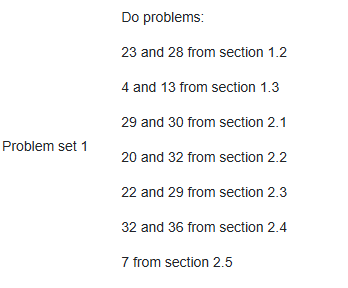

# Questions to solve



## 🔧 Coding Tasks 
### ✅ **Task 1: Implement Gaussian Elimination**

**Concept:** Solving systems of linear equations
**Goal:** Create a function that reduces a matrix to row echelon form (REF).

```python
def gaussian_elimination(A, b):
    # A is a 2D list (matrix), b is RHS vector
    # Returns augmented matrix in REF form
    pass  # implement forward elimination
```

**Input:**

```python
A = [[2, 1, -1], [-3, -1, 2], [-2, 1, 2]]
b = [8, -11, -3]
```

---

### ✅ **Task 2: Matrix Multiplication (No Libraries)**

**Concept:** Understand how dot product works in matrix multiplication
**Goal:** Multiply two matrices manually.

```python
def matrix_multiply(A, B):
    # Multiply two matrices A and B
    pass
```


---

### ✅ **Task 3: Inverse of a 2x2 Matrix**

**Concept:** Matrix inverse and its role in solving systems
**Goal:** Compute the inverse of a 2x2 matrix (if it exists).

```python
def inverse_2x2(matrix):
    # Return the inverse of a 2x2 matrix
    pass
```

**Bonus:** Handle cases when the matrix is singular (non-invertible).

---

### ✅ **Task 4: LU Decomposition**

**Concept:** Factorization of a matrix into lower and upper triangular matrices
**Goal:** Manually perform LU decomposition of a 3x3 matrix using Doolittle's method (no pivoting).

```python
def lu_decomposition(A):
    # Return L and U matrices
    pass
```

**Optional:** Use NumPy to verify your result.

---

### ✅ **Task 5: Solve Ax = b Using LU**

**Concept:** Use LU to solve systems of equations efficiently
**Goal:** Solve the system using:

1. LU Decomposition
2. Forward and backward substitution

```python
def solve_lu(A, b):
    # Use LU decomposition to solve Ax = b
    pass
```

---
